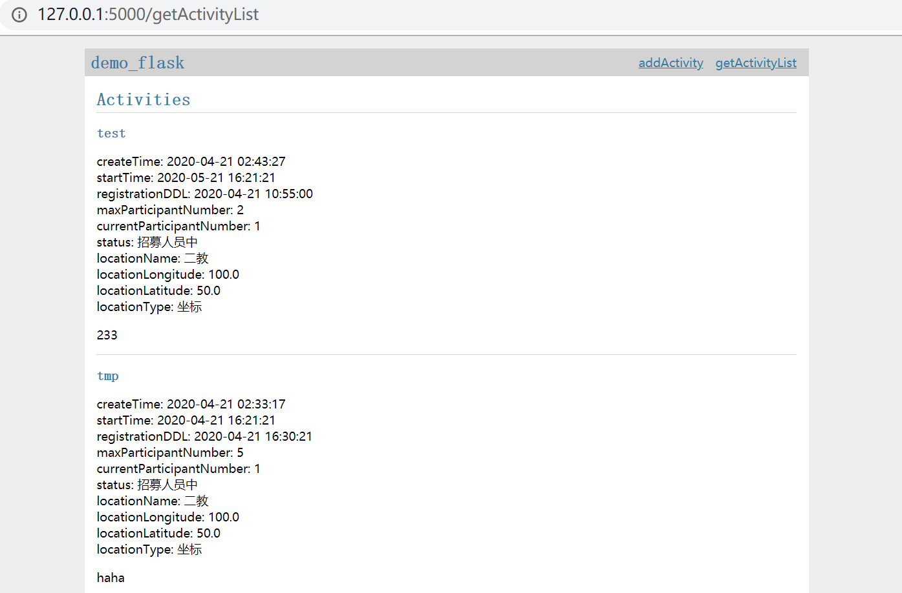

## flask后端


### ~~虚弱的~~1.0

### Layout

---

```
├── demo_flask/
│   ├── __init__.py
│   ├── db.py
│   ├── schema.sql
│   ├── templates/
│   │   ├── base.html
│   │   ├── addActivity.html
│   │   ├── getActivityList.html
│   │   └── activities.html
│   └── static/
│       └── style.css
└── instance/
    └── demo_flask.sqlite
```


### Installation（和flask官方文档中内容一样）

---

在包含上述两个文件夹的目录下：

Create a `venv` folder:

```
$ python3 -m venv venv
```

On Windows:

```
$ py -3 -m venv venv
```

Activate the corresponding environment:

```
$ . venv/bin/activate
```

On Windows:

```
> venv\Scripts\activate
```

Your shell prompt will change to show the name of the activated environment.

Within the activated environment, use the following command to install Flask:

```
$ pip install Flask
```


### Setup

---

For Linux and Mac:

```
$ export FLASK_APP=flaskr
$ export FLASK_ENV=development
$ flask init-db
Initialized the database.
$ flask run
```

For Windows cmd, use `set` instead of `export`:

```
> set FLASK_APP=flaskr
> set FLASK_ENV=development
> flask init-db
Initialized the database.
> flask run
```

For Windows PowerShell, use `$env:` instead of `export`:

```
> $env:FLASK_APP = "flaskr"
> $env:FLASK_ENV = "development"
> flask init-db
Initialized the database.
> flask run
```

You’ll see output similar to this:

```
* Serving Flask app "demo_flask"(lazy loading)
* Environment: development
* Debug mode: on
* Running on http://127.0.0.1:5000/ (Press CTRL+C to quit)
* Restarting with stat
* Debugger is active!
* Debugger PIN: 299-344-041
```

Visit <http://127.0.0.1:5000/addActivity> or <http://127.0.0.1:5000/getActivityList> in a browser.


### 目前实现的功能概述

---

demo_flask/templates/以及demo_flask/static/下都是借鉴flask tutorial里的网页前端代码，这里用于简单地测试一下写的后端，也便于前端同学理解接口。

按照上面的步骤查看 <http://127.0.0.1:5000/addActivity> or <http://127.0.0.1:5000/getActivityList> ，可以简单地测试一下增加活动与查看活动的功能。



1. addActivity

   填写表单的时候需要注意：

   ```startTime```和```registrationDDL```分别代表（线下）活动开始时间和报名截止时间，目前这版虚弱的后端可以接收的输入字符串格式必须严格是：```YYYY-mm-dd HH:MM:SS```；

   ```maxParticipantNumber```是整数；

   ```locationLongitude```和```locationLatitude```可以是浮点数；

   其余表项都接收字符串（可以为空的比如description也尽量不要为空，因为还没有仔细处理，可能会有bug）。

   点击“Save”后会有刷新反应，应该add成功了。

2. getActivityList

   填写表单的时候需要注意：

   ```time```表示要查询的最晚的创建时间（这里的时间需要确认一下究竟是哪个时间：创建时间、活动开始时间、报名截止时间），同样需要保证格式：```YYYY-mm-dd HH:MM:SS```（我自己测试的时候，创建活动的时间因为是数据库自己生成的，可能并不准确甚至相差很大，建议这里先填成明天的时间查一下）；

   ```limit```表示希望返回的活动个数，整数即可。

   点击“Get”后会返回活动列表，按照活动创建时间（或者之后可以改成按照另外两个时间）从新到旧排序。


### 与前端的交互

---

这部分主要参照```demo_flask/__init__.py```。

1. addActivity（```@app.route('/addActivity', methods=['GET', 'POST'])```）

   **对GET的处理**：可以忽略，这里用于返回网页前端的html以测试。

   **对POST的处理**：

   <u>接收</u>：

   接收的request目前是html的form形式（见```demo_flask/templates/addActivity.html```），不知道小程序是否也有类似的form；其实应该可以接收json格式的request，只是我这边测试的时候还不知道怎么构造这样的request，不过以json格式处理request的代码也留在```demo_flask/__init__.py```中，取消注释即可。

   接收内容如下：

   ```python
   title = request.form["title"]
   startTime = request.form["startTime"]
   registrationDDL = request.form["registrationDDL"]
   descript = request.form["description"]
   maxParticipantNumber = int(request.form["maxParticipantNumber"])
   locationName = request.form["locationName"]
   locationLongitude = float(request.form["locationLongitude"])
   locationLatitude = float(request.form["locationLatitude"])
   locationType = request.form["locationType"]
   ```

   <u>返回</u>：返回语句目前是```return render_template('addActivity.html')```，即html，可以直接修改或删除。

2. getActivityList（```@app.route('/getActivityList', methods=['GET', 'POST'])```）

   **对GET的处理**：可以忽略，这里用于返回网页前端的html以测试。

   **对POST的处理**：

   <u>接收</u>：

   接收的request目前也是html的form形式（见```demo_flask/templates/getActivityList.html```）；对json格式的request的处理也以注释形式保留。

   接收内容如下：

   ```python
   limit = int(request.form["limit"])
   time = request.form["time"]
   ```

   <u>返回</u>：

   返回语句目前是```return render_template('activities.html', data=jsonData)```，在```demo_flask/templates/activities.html```中对json数据的list```data```读取并显示；如果需要直接返回json数据的list，则```return jsonData```即可。

   返回的list中每一个json对象内容如下：(```row```是从数据库中获取的一行)

   ```python
   result = {} 
   result['name'] = str(row[0])
   result['createTime'] = row[1]
   result['startTime'] = row[2]
   result['registrationDDL'] = row[3]
   result['description'] = str(row[4])
   result['maxParticipantNumber'] = row[5]
   result['currentParticipantNumber'] = row[6]
   result['status'] = str(row[7])
   location = {}
   location['locationName'] = str(row[8])
   location['locationLongitude'] = row[9]
   location['locationLatitude'] = row[10]
   location['locationType'] = str(row[11])
   result['location'] = location
   ```


### 数据库

---

目前直接使用python提供的sqlite3，之后需要更换更大型的数据库。

1. 数据库定义（见```demo_flask/schema.sql```）

   1. user表：目前没有使用，只是简单定义了一下。

   2. activity表：目前定义的属性如下：

      ```sqlite
      id INTEGER PRIMARY KEY AUTOINCREMENT,
      createTime TIMESTAMP NOT NULL DEFAULT CURRENT_TIMESTAMP,
      title TEXT NOT NULL,
      startTime TIMESTAMP NOT NULL,
      registrationDDL TIMESTAMP,
      descript TEXT,
      maxParticipantNumber INTEGER,
      currentParticipantNumber INTEGER NOT NULL DEFAULT 1,
      stat TEXT NOT NULL DEFAULT '招募人员中',
      locationName TEXT,
      locationLongitude REAL,
      locationLatitude REAL,
      locationType TEXT
      ```

      这里我想到的有待讨论的问题是：

      - stat（活动所处状态）：应该是ENUM类型，但是sqlite似乎没有
      - locationType：需要看小程序的定义，可能也是需要ENUM类型
      - location的四个属性是否需要聚合，甚至另外开location的表

2. 数据库操作（见```demo_flask/db.py```）

   这个文件和flask文档tutorial中的是一样的，其中定义了一个新的命令行操作```init-db```，在上面Setup中执行，可以初始化数据库。


### Problems To Be Fixed...

---

1. 有关时间：

   三个时间（createTime、startTime、registrationDDL）在数据库中的定义都是TIMESTAMP，但是在存取的时候，我并没有进行字符串与时间戳之间的类型转换；在```where```语句中与输入的查询时间进行比较也感觉是字符串式的比较（因此如果在网页前端输入"2020-4-21 21:40:00"，会认为这个时间比"2020-04-21 21:40:00"晚）

2. Edge Cases的检测与处理：在插入或查询数据库的时候现在基本没有考虑到可能为空的项这种情况

3. 数据库定义的完善或修改

4. 更多功能逻辑的完善...

5. 更多有待发现的bug...
